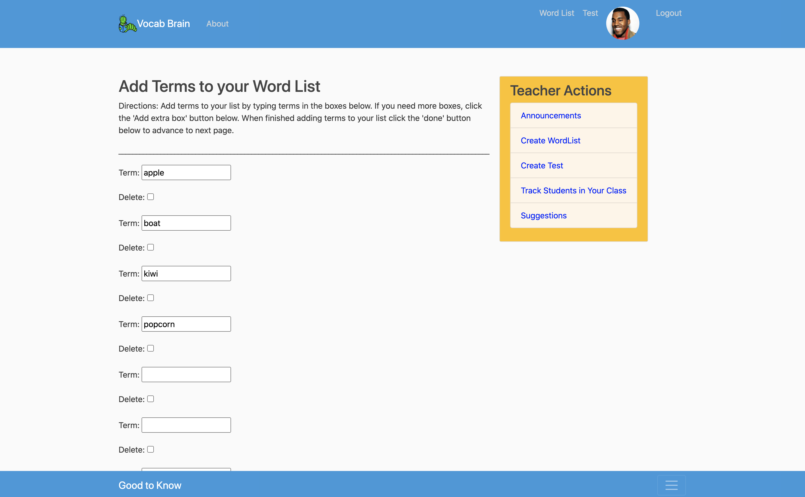
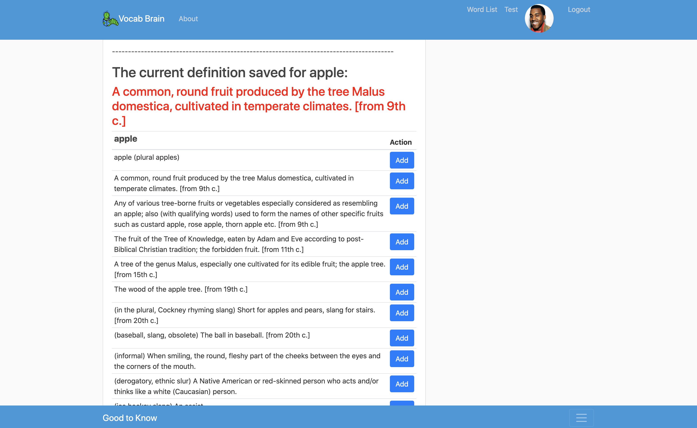
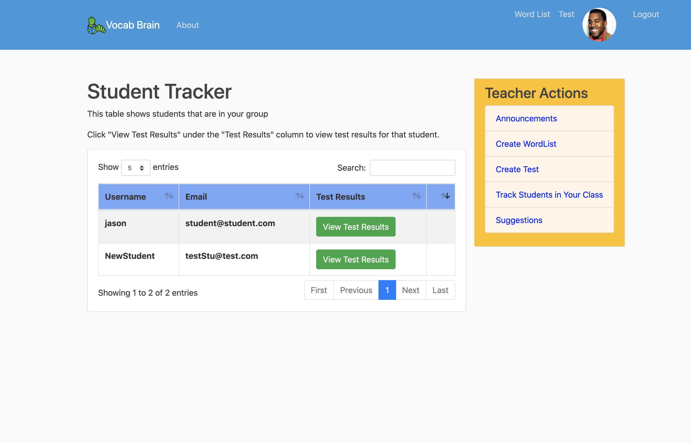
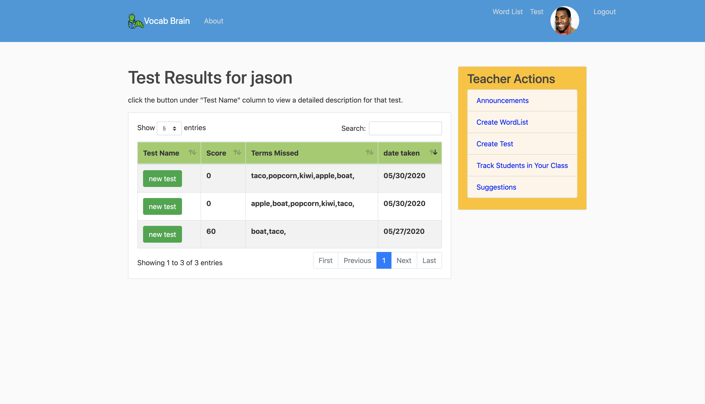
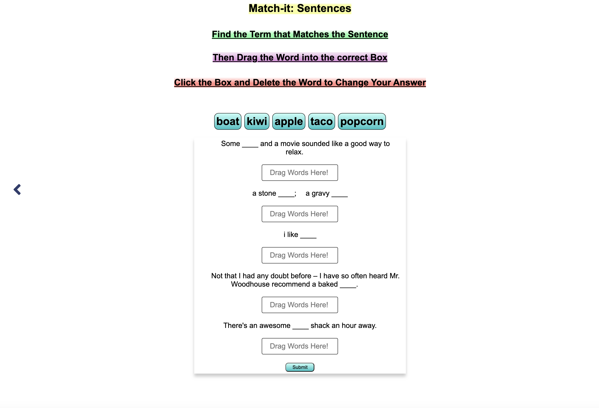
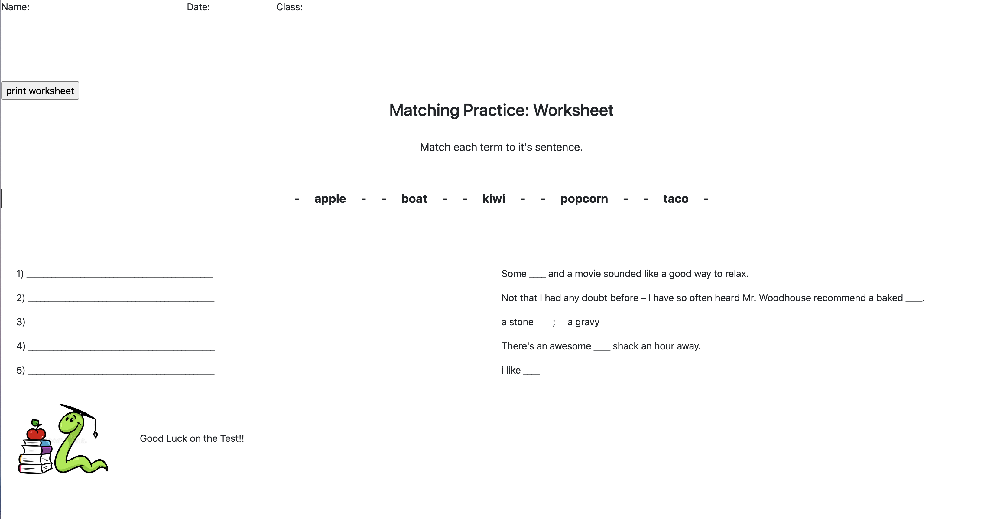

# Vocabbrain

Vocabbrain is a Web platform that helps support teacher/student remote learning. The website includes authentication for students and teachers to register as well as monitor their academic progress. Website is built using Django as backend, and the front end is designed using JavaScript, HTML and CSS.

Teachers can create their own vocab lists by first adding terms.

They will then add definitions and sentences to terms on following pages.

Teachers can track students that are in their classes.

Teachers can create tests based on their vocab lists. Students will be able to take a test on the list and have their scores saved.
 

There are games on site to help students study the terms.

There are printable worksheets that the teachers can create for their students.

